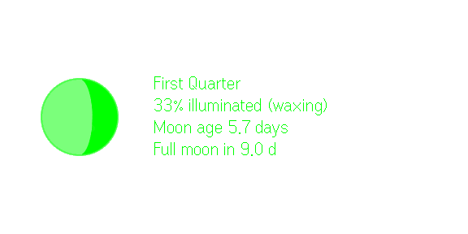

# Moon Phase — Even Realities G2 app

> The moon at a glance.

A small Even Hub plugin that shows the current moon on the glasses: the disc
itself, the phase name, % illuminated, moon age, and days to the next full or
new moon. Location (city-level) is used for one thing only: south of the
equator the moon appears mirrored, so the crescent is flipped accordingly.

| Full moon | Waxing (33%) |
| --- | --- |
|  |  |

*Screenshots from the official EvenHub simulator — the glasses render the same
576x288 canvas in monochrome green.*

## Install

Submitted to the Even Hub store — pending review. Once approved, install it
from the Even Realities phone app.

The rest of this README is for reading the code or contributing.

## Controls (on the glasses)
- **Tap** — refresh now
- **Double-tap** — exit (system confirmation dialog)

It also auto-refreshes every 30 minutes and only re-sends the moon image when
the illuminated percentage actually changes.

## Layout
576x288 canvas, three containers with explicit z-order:
1. Full-screen blank text container (`isEventCapture: 1`) — input collector,
   the standard "image-first app" pattern.
2. 144x144 image container — the moon, rendered to PNG on an offscreen canvas
   and pushed via `updateImageRawData` (the host converts to 4-bit grey).
3. Text container on the right — phase details, updated flicker-free with
   `textContainerUpgrade`.

## Development

Only needed if you're contributing or building your own app from this code —
users should install from the store (see above).

```bash
npm install
npm run dev          # dev server
npx evenhub-simulator http://localhost:5173/   # official simulator
```

The SDK, CLI, and simulator are all devDependencies — `npm install` is the
whole setup. If you fork this into your own app, change `package_id` in
`app.json` to your own reverse-domain id before packing (`npm run pack`).

## Notes
- `src/moon.ts` is dependency-free (truncated Meeus series). Checked against
  the Aug 12 2026 solar and Aug 28 2026 lunar eclipses — both land at exactly
  0% / 100%.
- Easy extensions: moonrise/set times from the same location fix, or a
  contextual-menu item to toggle hemisphere manually.

## Store listing

The exact copy submitted to the Even Hub store:

- **Name:** Moon Phase
- **Tagline:** The moon at a glance.
- **Category:** Utilities
- **Description:**

  > Moon Phase puts tonight's moon in your lens: the disc, the phase name,
  > percent illuminated, the moon's age in days, and a countdown to the next
  > full or new moon.
  >
  > The disc is drawn from the actual illuminated fraction, so the shape you
  > see matches the phase — a 33% moon looks like a 33% moon. If you allow
  > location access, the crescent is flipped for the southern hemisphere,
  > matching how the moon appears from your side of the equator. Location is
  > used only for that, at coarse accuracy, and the app defaults to the
  > northern-hemisphere view without it.
  >
  > The display refreshes every 30 minutes while the app is open. Tap to
  > refresh immediately; double-tap to exit.
  >
  > For stargazers, photographers planning a shoot, anglers watching the lunar
  > calendar, or anyone who's glanced up and wondered how many nights until
  > full.

- **Permissions:** Location only.
- **Data collection:** None. Location is read on-device once at launch to
  orient the moon for the user's hemisphere; it is never stored, logged, or
  transmitted.
- **Third-party services:** None. The packaged app is fully self-contained
  and makes no network requests.
- **AI technology:** None — the moon math is a deterministic truncated Meeus
  series.

## License

[MIT](LICENSE)
